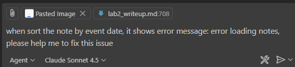

# Lab 2 Writeup - Note-Taking Application with AI Features

**Course**: COMP5421 - Software Engineering And Development
**Student**: 24120919g Yau Ming Sum  
**Repository**: [yausum/Notetaking-App](https://github.com/yausum/Notetaking-App)  
**Deployed URL**: [https://notetaking-app.vercel.app](https://notetaking-9v26e1vkq-yau-ming-sums-projects.vercel.app/)

## 🎯 Project Overview

This project is a full-stack note-taking web application featuring AI-powered capabilities for note generation, translation, and smart categorization. The application enables users to create, edit, search, and organize notes with optional event dates and times.

## Lesson Learned

By completing this project, I gained a lot of valuable experience, particularly in managing complex development tasks effectively.

- Task Breakdown: I learned the importance of splitting complex tasks into smaller subtasks. Since AI tools often struggle with highly complex instructions, breaking them down helped achieve better results with fewer bugs. Please feel free to review my development process and detailed steps in the section below.

- AI Development Guidance: Providing a structured layout or design reference for the AI during development made its output more precise and aligned with expectations.

- Review AI-generated content carefully, as AI may sometimes produce inaccurate or unintended results.
- Provide clear and detailed instructions to help the AI generate more accurate and relevant outputs.

### Challange
Sometimes, the AI may generate errors or behave unexpectedly. By providing clear references and well-defined prompts to guide the AI, the issues can eventually be resolved.

## 🚀 Development Process and steps

### Phase 1: Initial Setup (SQLite Version)
At the very beginning, I chose to use GitHub Copilot Agent Mode (Claude Sonnet 4.5) to help generate the initial setup for the note-taking application. Unfortunately, I no longer have the screenshot from this stage, but I can provide the Copilot chat history as a reference.

I instructed the AI to assist me in creating a note-taking web application with the following requirements:
- Frontend: CSS HTML Javascript
- Backend: python flask
- database: sqlite

The AI then generated the initial project setup based on these specifications.

Since the AI generated some code I wasn’t familiar with, I asked it to explain the program to me. The AI provided clear explanations, which helped me gain a better understanding of the generated code.

Next, I asked the AI to update the README.md file so that it included a complete overview of the program structure and related information.

Once everything was ready, I made my first commit to GitHub.

I found that the project’s folder structure was not well organized, so I asked the AI to help reorganize it. Specifically, I requested the following layout:
- A frontend folder to store all frontend-related files
- A backend folder to store all backend-related files
- A database folder to store the database file
This restructuring made the overall project structure cleaner, more modular, and easier to maintain.

Then, I noticed that my note-taking application was missing a list of tags, as well as date and time fields for each event. To address this, I asked the AI to modify the program and update the database structure accordingly.

Next, I realized that a sorting function would be helpful to use alongside the search bar, allowing users to organize their notes more efficiently. Therefore, I asked the AI to add this feature to the project.

Unfortunately, the search bar was not positioned correctly as expected. To fix this, I asked the AI to move the search bar and place it alongside the top navigation bar.

After testing the updated program, I discovered that the AI had mistakenly added an unnecessary sorting dropdown next to the search bar, which was not user-friendly. I decided to remove this component and instructed the AI to do so.

Once the basic functionality was completed and thoroughly tested, I committed and pushed the latest changes to GitHub.

### Phase 2: AI Features Integration

To integrate AI capabilities into the note‑taking application, I prepared a prompt instructing the AI to create a Python file named llm.py.
This file is responsible for connecting to the OpenAI API and handling all AI-related operations within the project.

However, I found that the generated code was not working properly, so I asked the AI to help identify the issue.

After fixing the error, I asked the AI to regenerate the entire program and add a translation function to enhance its capabilities.

After completing the basic translation feature, I asked the AI to modify the source code to extend this functionality. The goal was to enable the translation feature to also work when adding new notes or editing existing ones.

Something went wrong with the AI-generated code, but after I provided the entire error message, the issue was successfully resolved.

 

Next, I asked the AI to create a note‑generating function, providing it with precise details and clear instructions to ensure accurate implementation.

I realized that I had missed providing an important requirement earlier, so I gave the AI some additional supporting information to help it generate a more accurate result.

Next, I asked the AI to extend the “Generate Notes” function so that it could automatically extract the date and time from the content, when available.

I found that the “Generate Notes” function did not generate categories as expected, so I asked the AI to fix this issue by providing more detailed prompts and additional clarification.

### Phase 3: Database Migration (SQLite → Supabase)

After completing the AI feature integration, I moved on to the database migration phase, transitioning the system from SQLite to Supabase for improved scalability and cloud-based data management.

As I wasn’t familiar with Supabase, I asked the AI for guidance on how to configure and set it up properly.

The AI provided me with two different methods to configure Supabase.

I decided to adopt the second configuration method, and the AI helped me modify my code accordingly.

I reviewed and performed testing on the program, confirming that it works as expected.

### Phase 4: Deployment to Vercel

First, I asked the AI how to deploy my source code to Vercel, so I could host the web application online.

I followed the instructions and successfully deployed the project to Vercel. However, after the deployment process was completed, I discovered that all the CSS styles were missing in the production environment.

Then, I told the AI to help me fix the problem.

After testing, I discovered another bug, so I pasted the full error screenshot to the AI and asked it to help solve the problem.

### Finished !!

##  Future Improvements

### 1. User Authentication
- Add Supabase Auth for user accounts
- Make notes private per user (Row Level Security)
- Implement user profiles and preferences

**End of Lab 2 Writeup**  
**Date Completed**: October 25, 2025  
**Student**: 24120919g, Yau Ming Sum

